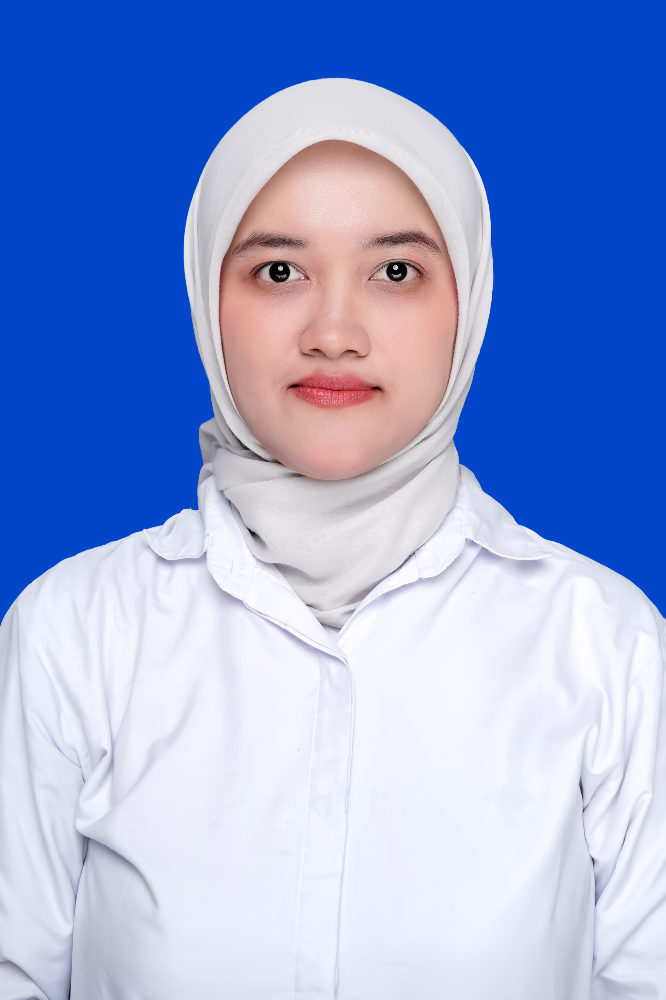

<!DOCTYPE html>
<html lang="id">
<head>
<meta charset="UTF-8">
<meta name="viewport" content="width=device-width, initial-scale=1.0">
<title>MPI Informatika — Analisis Data | SMP Negeri 1 Pucuk</title>

</head>
<body>

  <!-- ============ PAGE 1: COVER ============ -->
  

    

      

        
        

          
SMP Negeri 1 Pucuk

          
Dinas Pendidikan • Kurikulum Merdeka

        

      

      

        
Kurikulum Merdeka

        
Fase D

      

    

    

      
Media Pembelajaran Interaktif

      
Analisis Data

      
Informatika — Kelas VIII SMP

      
Belajar mencari, menyaring, memvisualisasikan, dan meringkas data dalam aplikasi pengolah lembar kerja

      <button id="btn-mulai" onclick="playClick(); goTo('menu');">▶</button>
      
MULAI

    

    

      👩‍🏫 Disusun oleh <b id="cover-guru-name">Karinika Susanto Putri, S.Pd.</b>
      •
      SMP Negeri 1 Pucuk
      •
      "Data yang terolah adalah keputusan yang tercerahkan"
    

  

  <!-- ============ PAGE 2: MENU ============ -->
  

    

      

        <button class="nav-btn" onclick="playClick(); goTo('cover');" title="Beranda">🏠</button>
        
BERANDA

      

      

        

          <button onclick="changeFont(-1)">A-</button>
          <button onclick="changeFont(1)">A+</button>
        

        <button class="nav-btn" id="btn-sound" onclick="toggleSound()" title="Suara">🔊</button>
      

    

    
📚 Menu Utama

    

      

        
🎯

        <h3>Tujuan Pembelajaran</h3>
        
Capaian &amp; indikator kompetensi siswa

      

      

        
📖

        <h3>Materi Pembelajaran</h3>
        
Eksplorasi konsep kunci analisis data

      

      

        
🕹️

        <h3>Simulasi Interaktif</h3>
        
Laboratorium olah data lembar kerja

      

      

        
📝

        <h3>Evaluasi Multi-Format</h3>
        
3 babak uji pemahaman • 100 poin

      

      

        
👨‍🏫

        <h3>Profil Guru</h3>
        
Informasi fasilitator pendidik

      

      

        
💡

        <h3>Wawasan &amp; Fakta</h3>
        
Fakta menarik seputar data

      

    

  

  <!-- ============ PAGE 3: TUJUAN ============ -->
  

    

    
🎯 Tujuan Pembelajaran

    

      
Setelah mempelajari materi ini, murid mampu:

      
🔍
Menjelaskan dan mempraktikkan cara <b>pencarian data</b> (sort &amp; filter) pada aplikasi pengolah lembar kerja secara tepat.

      
📊
Membuat <b>visualisasi data</b> dalam bentuk grafik/diagram yang sesuai untuk menyajikan informasi secara jelas.

      
🧮
Melakukan <b>peringkasan data</b> menggunakan fungsi statistik dasar (SUM, AVERAGE, COUNT, MAX, MIN).

      
🧠
Menginterpretasikan hasil olahan data untuk mendukung pengambilan keputusan sehari-hari.

    

  

  <!-- ============ PAGE 4: MATERI ============ -->
  

    

    
📖 Materi Inti: Analisis Data

    

      

        
🔍

        
<h4>Pencarian Data</h4>
Menggunakan fitur Find, Filter, dan fungsi lookup untuk menemukan data tertentu dengan cepat.

      

      

        
↕️

        
<h4>Pengurutan &amp; Penyaringan</h4>
Sort (A-Z/Z-A) dan Filter membantu menyusun serta menampilkan data sesuai kriteria tertentu.

      

      

        
📈

        
<h4>Visualisasi Data</h4>
Grafik batang, garis, dan lingkaran mengubah angka menjadi gambar yang mudah dipahami.

      

      

        
Σ

        
<h4>Peringkasan Data</h4>
Fungsi SUM, AVERAGE, COUNT meringkas kumpulan data menjadi informasi inti.

      

      

        
📐

        
<h4>Fungsi Statistik Dasar</h4>
MAX, MIN, dan MEDIAN membantu menemukan nilai tertinggi, terendah, dan tengah.

      

      

        
🧭

        
<h4>Interpretasi Data</h4>
Membaca pola data untuk mengambil keputusan yang tepat dan berbasis bukti.

      

    

  

  <!-- ============ PAGE 5: SIMULASI ============ -->
  

    

    
🕹️ Simulasi: Laboratorium Olah Data

    

      

        <button class="sim-btn" onclick="simSort()">↕️ Urutkan Nilai</button>
        <button class="sim-btn alt" onclick="simSearchMax()">🔍 Cari Nilai Tertinggi</button>
        <button class="sim-btn alt2" onclick="simAverage()">Σ Tampilkan Rata-rata</button>
        <button class="sim-btn" style="background:linear-gradient(135deg,#94a3b8,#64748b)" onclick="simReset()">↺ Reset</button>
        
Mode: Data Awal

      

      

        <svg id="sim-svg" viewBox="0 0 700 360" xmlns="http://www.w3.org/2000/svg"></svg>
      

    

  

  <!-- ============ PAGE 6: EVALUASI ============ -->
  

    

    

      
📝 Evaluasi Pemahaman

      

        

        

        

        

      

      
Skor: 0/100

    

    

      <!-- Babak A -->
      

        

          
Babak A • Pilihan Ganda — Soal 1 dari 3

          

          

          
<button class="btn-next" id="qa-next" onclick="nextA()">Lanjut ➜</button>

        

      

      <!-- Babak B -->
      

        

          
Babak B • Menjodohkan — Klik istilah lalu klik pasangannya

          

            <svg id="match-svg" viewBox="0 0 700 340" xmlns="http://www.w3.org/2000/svg"></svg>
          

        

      

      <!-- Babak C -->
      

        

          
Babak C • Benar/Salah — Soal 1 dari 3

          

          

            <button class="tf-btn tf-true" onclick="answerTF(true)">✓ BENAR</button>
            <button class="tf-btn tf-false" onclick="answerTF(false)">✗ SALAH</button>
          

          
<button class="btn-next" id="qc-next" onclick="nextC()">Lanjut ➜</button>

        

      

      <!-- Babak D -->
      

        

          
🏆

          
0 / 100

          

            
Babak A: 0/30

            
Babak B: 0/40

            
Babak C: 0/30

          

          

            <input type="text" id="student-name-input" placeholder="Nama murid...">
            <button class="btn-small" onclick="saveScore()">💾 Simpan Skor</button>
            <button class="btn-small" style="background:linear-gradient(135deg,#94a3b8,#64748b)" onclick="resetEvaluasi()">↺ Ulangi</button>
          

          

        

      

    

  

  <!-- ============ PAGE 7: PROFIL ============ -->
  

    

    

      
      

        
Karinika Susanto Putri, S.Pd.

        
Guru Mata Pelajaran Informatika

        
SMP Negeri 1 Pucuk

        
"Data yang diolah dengan baik akan menuntun kita pada keputusan yang lebih bijak."

      

    

  

  <!-- WAWASAN POPUP -->
  

    

      
💡

      
Tahukah Kamu?

      

      <button class="btn-small" onclick="closeWawasan()">Tutup</button>
    

  

</body>
</html>
